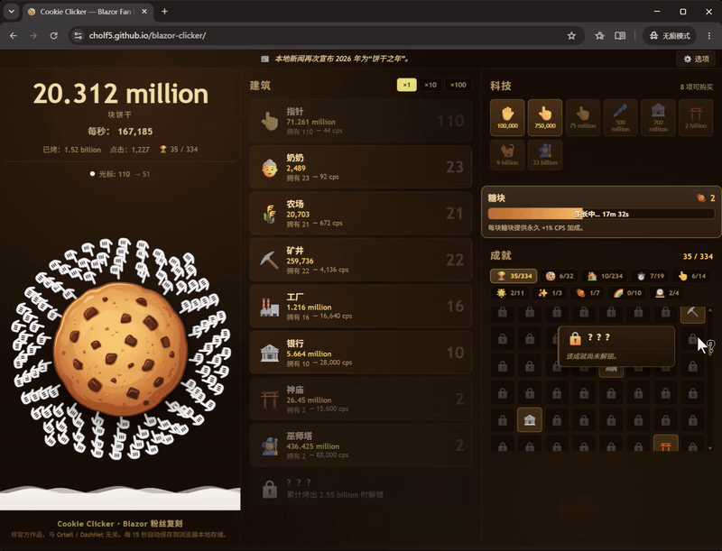
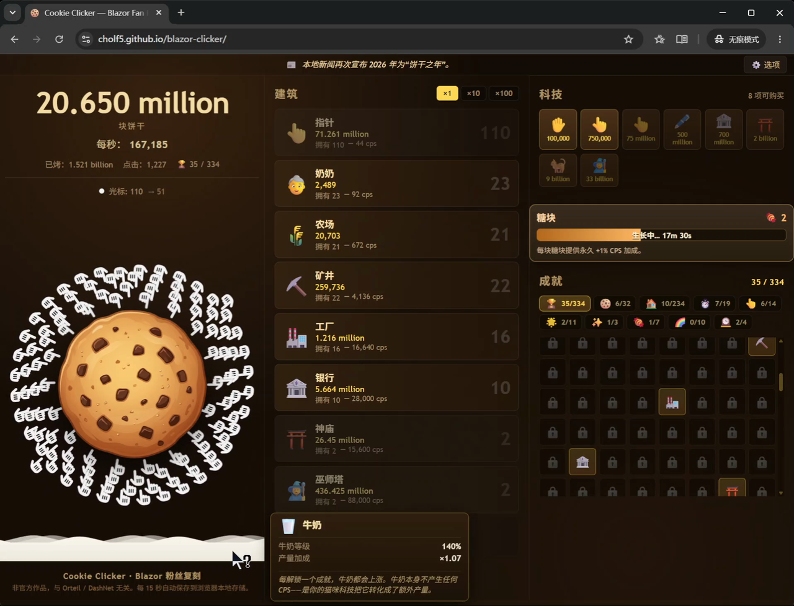
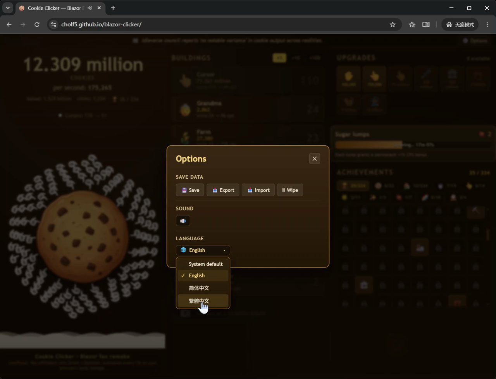

<div align="center">

# 🍪 Cookie Clicker — Blazor Fan Remake

**An unofficial, from-scratch reimplementation of Cookie Clicker's early-game growth loop, built in C# / Blazor WebAssembly.**

[](https://cholf5.github.io/blazor-clicker/)
[](https://dotnet.microsoft.com/)
[](https://learn.microsoft.com/aspnet/core/blazor/)
[](tests/Game.Core.Tests)
[-blue?style=flat-square)](LICENSE)
[](src/Game.Core/Localization)



</div>

> ⚠️ **Unofficial fan project.** Not affiliated with, endorsed by, or derived from the
> source code of Orteil / DashNet's Cookie Clicker. No original source, art, audio, or
> flavor text is reused — only unprotectable mechanics/numbers and 12 generic building
> names. See [`NOTICE.md`](./NOTICE.md) for full attribution and the take-down policy.
>
> 非官方粉丝作品。未附属于、未获授权于、也未复制原版 Cookie Clicker 的源码；未复用任何
> 原版源码、美术、音效或文案，仅保留不受版权保护的机制/数值与 12 个通用建筑名。详见
> [`NOTICE.md`](./NOTICE.md)。

---

## ✨ What is this?

A **modern rebuild** of an old, UI-dense incremental game — the kind whose original
`main.js` crams 3000+ lines into a single god class. The goal was to reconstruct the
early-game *pure exponential growth* toy as a **layered, testable, maintainable** web
app, and to use it as a serious Blazor WebAssembly learning vehicle.

The result is a **complete, self-contained core game** you can play right now in your
browser — no install, no account, no ads, no tracking.

> 用现代技术栈重构一个 UI 密集的老式增量游戏，把原版塞在单个 god class 里的 3000+ 行逻辑
> 拆成**分层清晰、可测试、可持续演进**的现代 Web 应用。本项目**只做**早期「纯指数增长」形态，
> 但把这个核心做**完整**——打开浏览器即玩，无需安装、无账号、无广告、无监测。

<div align="center">
<table>
<tr>
<td width="50%"></td>
<td width="50%"></td>
</tr>
<tr>
<td align="center"><em>三栏布局 · 建筑 / CPS / 成就</em></td>
<td align="center"><em>选项 · 支持多种语言</em></td>
</tr>
</table>
</div>

---

## 🎮 Features / 功能亮点

- 🏭 **18 buildings** — the early 12 (Cursor → Time Machine) plus 6 late-game
  additions, with single / ×10 / ×100 batch buying and cost-scaling formulas.
- 🔬 **83 upgrades** — per-building tier multipliers, click power, cursor synergy,
  and global CPS boosts, all driven by a generic `EffectKind` system.
- 🏆 **334 achievements** — baked/CPS milestone ladders, clicking, golden-cookie
  combos, sugar lumps, ascensions and play-time, grouped into filterable tabs.
- 🍀 **Golden cookies** — Lucky / Frenzy / Click Frenzy buffs, timed spawns.
- 🥛 **Milk** — a passive, achievement-driven CPS axis.
- 🍬 **Sugar lumps** — a spendable building-level currency (24h ripening).
- ⭐ **Prestige / Ascension** — `cbrt(baked / 1e12)` heavenly chips, +permanent CPS.
- 💤 **Offline earnings** — 50% efficiency, capped at 24h, "welcome back" dialog.
- 🔊 **Synthesized audio** — Web Audio, zero external assets; particle & floating-text FX.
- 📰 **News ticker** — event-priority + ambient flavor + progress headlines.
- 🌍 **Trilingual** — English, 简体中文, 繁體中文 (English is the source & fallback).
- 💾 **Versioned saves** — JSON + Base64 export/import, 15s autosave, stepwise migration.

---

## 🛠 Tech Stack / 技术栈

| Layer / 层 | Choice / 选择 |
|---|---|
| Language | C# (.NET 10) |
| UI | Blazor WebAssembly |
| Domain logic | Standalone `Game.Core` class library — **zero** Blazor/DOM/JS deps |
| State | Plain C# objects + `StateHasChanged()` polling |
| Persistence | `System.Text.Json` + Base64 + `IJSRuntime` localStorage |
| Effects | CSS + Blazor components + Web Audio (no canvas) |
| Tests | xUnit against `Game.Core` — pure logic, sub-second, browser-free |
| Build & deploy | `dotnet publish` → static files → GitHub Pages (GitHub Actions) |

**Why Blazor?** One language, no glue layer, first-party long-term support, and a type
system that *forces* the god class apart. `Game.Core` runs headless under xUnit, and the
static publish deploys free to GitHub Pages. Alternatives evaluated (Godot / Unity / Uno /
React+C#-WASM / plain React) are recorded in [ADR 0001](docs/decisions/0001-technology-stack.md).

> 单一技术栈、无胶水层、微软官方长期维护，类型系统天然逼着拆 god class；`Game.Core` 可脱离
> 浏览器用 xUnit 测试，静态发布白嫖 GitHub Pages。其他备选方案的取舍见 ADR 0001。

**Known trade-offs / 已知代价:** the first load pulls a few MB of .NET runtime (AOT +
trimming can shrink it to 1–2 MB); AI codegen for Blazor is less mature than for React.

---

## 🏗 Architecture / 架构

Strict one-way dependency: **UI → domain, never the reverse.**

```
src/
├── Game.Core/          # The whole game as pure C#. No Blazor/DOM/JS. All rules live here.
│   ├── Domain/         #   GameState (aggregate root), buildings, upgrades, golden cookies…
│   ├── Data/           #   Static catalogs: 18 buildings, 83 upgrades, 334 achievements, news
│   ├── Localization/   #   EN / 简中 / 繁中 overlay dictionaries + detection
│   ├── Formulas.cs     #   Cost & batch-price math (economy constants centralized)
│   └── SaveSystem.cs   #   JSON ⇄ SaveData DTO (v5) + Base64 + stepwise migration
├── Game.Web/           # Blazor WASM. Renders Game.Core, forwards input. No business logic.
│   ├── Components/      #   BigCookie, StatsPanel, UpgradeStore, AchievementList, tooltips…
│   ├── Services/        #   GameLoop (~30fps), SaveCoordinator, Audio, Tooltip, UpdateChecker
│   └── Pages/Home.razor #   Three-column shell + particles + offline dialog
└── tests/Game.Core.Tests/   # 99 xUnit cases — formulas, buying, upgrades, achievements,
                              # saves, golden cookies, sugar lumps, prestige, offline, i18n
```

Key invariants:

- **`Tick(deltaSeconds)` is the only clock.** It applies passive CPS, expires buffs,
  spawns/despawns golden cookies, ripens sugar lumps, and checks achievements — in order.
- **The UI polls** query methods (`CurrentCps()`, `ClickPower()`, `AvailableUpgrades()`…)
  every frame; nothing is cached. Notifications flow one way: the domain enqueues, the UI drains.
- **Content is data, not code.** To add a building/upgrade/achievement, add a `record` to a
  catalog — don't scatter conditionals through `GameState`.
- **Saves are versioned.** Any schema change bumps `CurrentVersion` and adds a step migration.

Full ADR index, retrospectives and doc structure: [`docs/README.md`](docs/README.md).

---

## 🚀 Getting Started / 本地开发

Requires **.NET 10 SDK** (verified on `10.0.301`).

```bash
# Restore (first run / when dependencies change)
dotnet restore Game.slnx

# Run all tests
dotnet test Game.slnx -c Release

# Local dev server with hot reload → https://localhost:5xxx
dotnet watch --project src/Game.Web

# Static publish (output in publish/wwwroot/)
dotnet publish src/Game.Web/Game.Web.csproj -c Release -o publish
```

> First publish may prompt you to install the `wasm-tools` workload for smaller output:
> `dotnet workload install wasm-tools`

---

## 📦 Deployment / 部署

Pushes to `main` trigger [`deploy.yml`](.github/workflows/deploy.yml): **restore → test →
publish → GitHub Pages**. The workflow rewrites `<base href>` for the repo subpath, adds
`.nojekyll`, and copies `index.html` to `404.html` for SPA fallback.

To enable on a fork: **Settings → Pages → Source = "GitHub Actions".**

---

## 📐 Scope Boundary / 范围边界

Per [ADR 0004](docs/decisions/0004-scope-boundary.md), this project **deliberately**
implements only the early-game pure-growth toy and **rejects** active-management late-game
systems: Garden, Stock Market, Pantheon, Grimoire, seasonal events, and (by default)
Wrinklers / Grandmapocalypse. The achievement count (~334 vs. the original's 622) is
intentionally *not* chased — the gap is a consequence of not building those subsystems, not
a backlog. New achievements should extend the pure-growth axis, not pad the count.

> 这不是「半成品」，而是**主动收敛的完整核心**：只做纯指数增长玩具，拒绝园艺/股市/万神殿等
> 主动管理型后期系统。成就数量差距是刻意取舍，不是待办。

---

## 📄 License & Attribution / 许可与归属

- **Original game** — Cookie Clicker by Julien "Orteil" Thiennot / DashNet
  ([official free web version](https://orteil.dashnet.org/cookieclicker/)). Names, art,
  audio, story and flavor text are © the original author.
- **This repo's [`LICENSE`](LICENSE) (MIT) covers the code only.** Game design and
  trademarks are not ours to license — keep [`NOTICE.md`](./NOTICE.md) when forking.
- **Non-commercial** — no ads, no tracking, no payment channels.
- **Take-down** — removed immediately if the original author objects (see `NOTICE.md`).

**Before you fork or redistribute, read [`NOTICE.md`](./NOTICE.md) and [`LICENSE`](LICENSE) first.**

---

<div align="center">
<sub>Built as a Blazor WebAssembly learning project. If you like it, consider leaving a ⭐.</sub>
</div>
